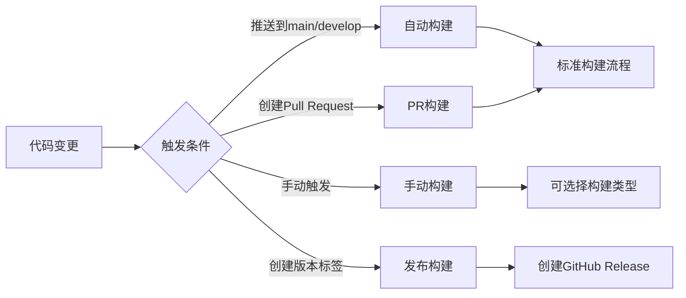
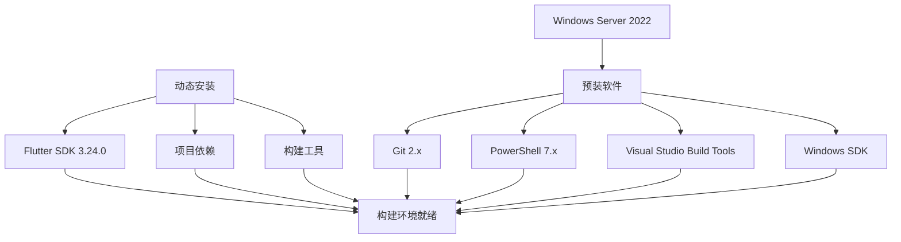
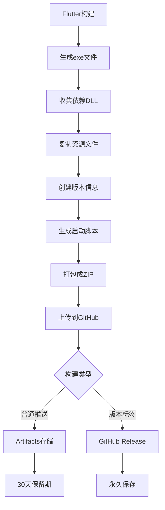

# 🔄 GitHub Actions构建流程图

## 📊 完整流程可视化

```mermaid
graph TD
    A[👨‍💻 开发者推送代码] --> B[🐙 GitHub接收代码]
    B --> C{🔍 检查触发条件}
    C -->|✅ 满足条件| D[🚀 启动Windows虚拟机]
    C -->|❌ 不满足| E[⏸️ 跳过构建]
    
    D --> F[📥 检出代码]
    F --> G[🔧 安装Flutter SDK]
    G --> H[📦 获取项目依赖]
    H --> I[🔍 代码分析]
    I --> J[🧪 运行测试]
    J --> K[🔨 构建Windows应用]
    
    K --> L{✅ 构建成功?}
    L -->|✅ 成功| M[📦 打包应用]
    L -->|❌ 失败| N[📋 上传错误日志]
    
    M --> O[📤 上传构建产物]
    O --> P[📝 创建Release (如果是标签)]
    P --> Q[✅ 构建完成]
    
    N --> R[❌ 构建失败]
    
    Q --> S[📱 用户下载应用]
    R --> T[🔧 开发者修复问题]
    T --> A
```

## 🎯 触发条件详解



## 🏗️ 构建环境详情



## 📦 构建产物流程



## 🔄 自动化优势

### 传统方式 vs GitHub Actions

| 对比项目 | 传统方式 | GitHub Actions |
|---------|---------|----------------|
| 🖥️ 环境需求 | 需要Windows机器 | 无需本地环境 |
| 💰 成本 | 硬件+软件成本 | 完全免费 |
| ⏰ 构建时间 | 手动操作 | 全自动5-10分钟 |
| 🔄 一致性 | 环境差异 | 标准化环境 |
| 📦 版本管理 | 手动管理 | 自动版本控制 |
| 🚀 部署 | 手动分发 | 自动发布 |
| 📊 历史记录 | 难以追踪 | 完整构建历史 |
| 🔧 维护成本 | 高 | 极低 |

## 🎉 使用场景

### 适合的项目类型：
- ✅ 开源项目
- ✅ 个人项目
- ✅ 小团队项目
- ✅ 原型开发
- ✅ 学习项目

### 不适合的场景：
- ❌ 需要特殊硬件的应用
- ❌ 需要付费软件的构建
- ❌ 超大型项目（构建时间限制）
- ❌ 需要特殊网络环境的构建

## 💡 最佳实践建议

1. **分支策略**
   ```
   main分支 → 稳定版本构建
   develop分支 → 开发版本构建
   feature分支 → 功能测试构建
   ```

2. **版本管理**
   ```
   v1.0.0 → 正式发布
   v1.0.0-beta.1 → 测试版本
   v1.0.0-alpha.1 → 内测版本
   ```

3. **构建优化**
   ```
   缓存依赖 → 加速构建
   并行任务 → 提高效率
   条件构建 → 节省资源
   ```

这就是GitHub Actions自动构建的完整流程！🚀